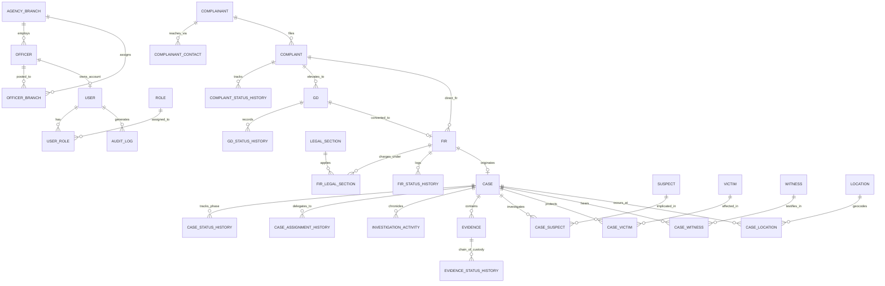
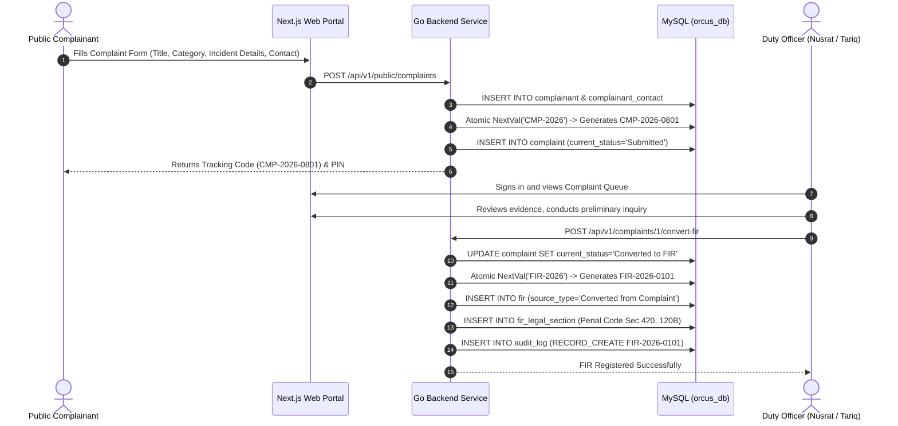
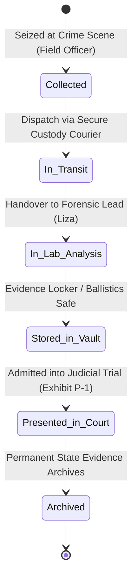

# ORCUS — Police Investigation Management & Case Tracking System
## Final Project Report & Comprehensive Technical Specification
**Course Code:** 06123228 — Database Management Laboratory  
**Academic Semester:** Summer 2026  
**Target Organization:** Bangladesh Police / Specialized Criminal Investigation Division (Academic Prototype)  
**Database Name:** `orcus_db` (MySQL 8.0+ / MariaDB 10.4+ InnoDB Engine, `utf8mb4`)

---

### Project Authors & Module Contributions

| Student Name | Student ID | Academic Role | Primary Module & System Responsibilities |
| :--- | :--- | :--- | :--- |
| **Md. Arafat Hossain Faisal** | **241400060** | **Project Team Lead** | **Module 1: Organization, Security & Administration**<br>• Core Relational Schema Architecture & 3NF Normalization<br>• User Authentication, Bcrypt Password Hashing & HttpOnly JWT<br>• Role-Based Access Control (RBAC) & Middleware Enforcers<br>• Agency Branches, Division/District/Thana Geographies<br>• Immutable Security Audit Logging (`audit_log`) & System Sequence Engine |
| **A.K. Md. Shakil Hossain** | **241400043** | **Investigation Lead** | **Module 2: Investigation Intake & Case Lifecycle**<br>• Citizen Complaint Intake & Verification Workflows<br>• General Diary (GD) Lifecycle & Escalations<br>• First Information Report (FIR) Engine & CrPC Sec 154 Compliance<br>• Legal Sections Integration (Bangladesh Penal Code & Cyber Security Act)<br>• Case Registry, Investigating Officer (IO) Assignment & Status History |
| **Ayshee Islam Liza** | **241400045** | **Forensics & Custody Lead**| **Module 3: Participants, Geocoding & Evidence Custody**<br>• Criminal Participants Profiling (Suspects, Victims, Witnesses)<br>• Multi-Incident Geolocation & GIS Incident Mapping (`location`)<br>• Physical & Digital Evidence Custody Management<br>• Cryptographic Integrity (SHA-256 Hashes & Tamper-Evident Seals)<br>• Multi-Hop Chain of Custody Audit Trail (`evidence_status_history`) |

---

## 1. Executive Summary & Problem Context

In Bangladesh's criminal justice administration, law enforcement stations (Thanas) and specialized investigation wings historically rely on paper-bound General Diaries, physical registers, and fragmented filing cabinets. This conventional methodology suffers from critical structural vulnerabilities:
1. **Evidence Tampering & Chain-of-Custody Failure:** Physical evidence often lacks an immutable, chronological record of custodianship from seizure to court trial, causing evidence inadmissibility under the Evidence Act.
2. **Delayed Escalation & Lost Complaints:** Citizen complaints filed at local stations lack transparent tracking, leading to administrative bottlenecks and public distrust.
3. **Information Silos Across Jurisdictions:** Criminal syndicates operating across metropolitan centers (Dhaka, Chattogram, Sylhet, Rajshahi, Khulna) exploit the lack of cross-branch visibility.
4. **Absence of Strict Access Control:** Manual files lack granular permission boundaries, audit trails, and accountability for unauthorized record modifications.

**ORCUS (Organized Crime Understanding System)** is a full-stack, enterprise-grade investigation management system built upon a strictly normalized (Third Normal Form - 3NF) relational database. It automates the entire law enforcement investigative pipeline—from public citizen intake and General Diary (GD) recording, to statutory First Information Report (FIR) filing, multi-officer case management, biometric suspect tracking, and tamper-proof evidence chain-of-custody logging.

---

## 2. Relational Database Design & Normalization (3NF)

The database schema (`orcus_db`) contains **28 tables** meticulously normalized to Third Normal Form (3NF) to guarantee zero data redundancy, eliminate update/insert/delete anomalies, and enforce referential integrity.

### 2.1 Normalization Justification

- **First Normal Form (1NF):**
  - All attributes contain only atomic values. Multi-valued attributes (e.g., complainant phone numbers and email addresses) have been extracted into separate child entities (`complainant_contact`).
  - Every table possesses an unambiguous Primary Key (e.g., `case_id`, `evidence_id`, `user_id`).
- **Second Normal Form (2NF):**
  - Meets all 1NF conditions.
  - All non-key attributes are fully functionally dependent on the entire primary key. In composite-key junction tables (e.g., `case_suspect`, `case_victim`, `case_witness`, `fir_legal_section`), non-key attributes such as `role_in_crime`, `impact_type`, and `testimony_summary` depend strictly on the combination of `(case_id, participant_id)`.
- **Third Normal Form (3NF):**
  - Meets all 2NF conditions.
  - No transitive dependencies exist ($X \to Y$ and $Y \to Z$ where $Z$ is non-prime).
  - Geographic designations (division, district, thana) are normalized into independent reference lookups rather than repeatedly denormalizing strings inside `location`.
  - Officer badge numbers, branch affiliations, and user login credentials are partitioned across `officer`, `agency_branch`, and `user` tables, preventing officer data corruption if login credentials change.

### 2.2 Entity Relationship Diagram (ERD)



### 2.3 Data Dictionary & Constraint Matrix

#### Module 1: Organization, Security & Administration (Arafat Hossain Faisal)
1. **`agency_branch`**: Physical police commands and divisions.
   - `branch_id` (INT, PK, AI)
   - `branch_name` (VARCHAR(100), NOT NULL), `name_bn` (VARCHAR(100))
   - `branch_code` (VARCHAR(20), UNIQUE, NOT NULL, e.g. `BR-DHK-MOT`)
   - `branch_type` (VARCHAR(50)), `district` (VARCHAR(50))
   - `contact_number` (VARCHAR(20)), `is_active` (TINYINT(1), DEFAULT 1)
2. **`officer`**: Sworn law enforcement personnel.
   - `officer_id` (INT, PK, AI)
   - `badge_no` (VARCHAR(20), UNIQUE, NOT NULL, e.g. `ORC-1001`)
   - `first_name` (VARCHAR(50)), `last_name` (VARCHAR(50)), `rank` (VARCHAR(50))
   - `branch_id` (INT, FK $\to$ `agency_branch.branch_id`, ON DELETE RESTRICT)
3. **`officer_branch`**: M:N junction for multi-branch deputations and primary postings.
   - `officer_id` (INT, FK $\to$ `officer.officer_id`, ON DELETE CASCADE)
   - `branch_id` (INT, FK $\to$ `agency_branch.branch_id`, ON DELETE RESTRICT)
   - `is_primary` (TINYINT(1), DEFAULT 1), `assigned_at` (DATETIME)
4. **`user`**: System authentication principals.
   - `user_id` (INT, PK, AI)
   - `username` (VARCHAR(50), UNIQUE, NOT NULL)
   - `password_hash` (VARCHAR(255), NOT NULL, Bcrypt $2a$10$)
   - `officer_id` (INT, UNIQUE, NULLABLE, FK $\to$ `officer.officer_id`, ON DELETE SET NULL)
   - `is_active` (TINYINT(1), DEFAULT 1), `failed_login_attempts` (INT, DEFAULT 0)
5. **`role` & `user_role`**: Granular Role-Based Access Control matrix.
   - Roles include: `Administrator`, `Lead Investigator`, `Investigating Officer`, `Duty Officer`, `Forensic Specialist`, `Evidence Officer`, `System Auditor`.
6. **`audit_log`**: Append-only security and operational audit ledger.
   - `audit_id` (BIGINT, PK, AI)
   - `request_id` (VARCHAR(64)), `user_id` (INT, FK $\to$ `user.user_id`)
   - `event_type` (`AUTH_LOGIN`, `RECORD_CREATE`, `RECORD_UPDATE`, `RECORD_DELETE`)
   - `entity_type` (VARCHAR(50)), `entity_id` (VARCHAR(50)), `action` (VARCHAR(50))
   - `route` (VARCHAR(255)), `http_method` (VARCHAR(10)), `ip_address` (VARCHAR(45))
   - `before_summary` (TEXT), `after_summary` (TEXT), `result` (`SUCCESS`/`FAILED`)
7. **`system_sequence`**: Atomic sequence counter for canonical reference numbers.
   - Key-value generator ensuring sequential, gapless references (`CMP-YYYY`, `GD-BR-YYYY`, `FIR-YYYY`, `CAS-YYYY`).

#### Module 2: Investigation Intake & Case Lifecycle (A.K. Md. Shakil Hossain)
8. **`complainant` & `complainant_contact`**: Citizen reporting entities.
   - Normalized 1:M relationship separating personal identities from multiple communication channels (phone, email, emergency contact).
9. **`complaint`**: Citizen submissions and field intakes.
   - `complaint_id` (INT, PK, AI)
   - `tracking_code` (VARCHAR(32), UNIQUE, NOT NULL, e.g. `CMP-2026-0801`)
   - `title`, `description`, `incident_date`, `incident_time`
   - `current_status` (`Submitted`, `Under Review`, `Converted to GD`, `Converted to FIR`, `Rejected`)
   - `urgency` (`Low`, `Medium`, `High`, `Critical`)
   - `receiving_branch_id` (INT, FK), `assigned_reviewer_id` (INT, FK)
   - `public_status_message` (TEXT, citizen-safe status), `internal_notes` (TEXT, police-only)
10. **`gd` (General Diary)**: Pre-FIR formal police ledger for non-cognizable incidents.
    - `gd_id` (INT, PK, AI)
    - `gd_number` (VARCHAR(30), UNIQUE, NOT NULL, e.g. `GD-DHK-2026-0012`)
    - `branch_id` (INT, FK), `gd_date` (DATE), `subject` (VARCHAR(255))
    - `current_status` (`Draft`, `Approved`, `Closed`, `Converted to FIR`)
11. **`fir` (First Information Report)**: Statutory criminal filing under CrPC Sec 154.
    - `fir_id` (INT, PK, AI)
    - `fir_number` (VARCHAR(30), UNIQUE, NOT NULL, e.g. `FIR-2026-0101`)
    - `crime_category` (VARCHAR(100)), `place_of_occurrence` (VARCHAR(255))
    - `gd_id` (INT, NULLABLE, FK $\to$ `gd.gd_id`), `source_complaint_id` (INT, NULLABLE, FK)
    - `source_type` (`Direct`, `Converted from GD`, `Converted from Complaint`)
12. **`legal_section` & `fir_legal_section`**: Statutory Penal Code mappings.
    - Captures specific statutory offenses: Penal Code 420 (Fraud), 384 (Extortion), 395 (Dacoity), 120B (Criminal Conspiracy), Cyber Security Act Sec 17.
13. **`case`**: Master investigation operational dossier.
    - `case_id` (INT, PK, AI)
    - `case_number` (VARCHAR(30), UNIQUE, NOT NULL, e.g. `CAS-2026-0001`)
    - `case_title` (VARCHAR(255)), `status` (`Open`, `Under Investigation`, `Pending Review`, `Closed`, `Reopened`)
    - `priority` (`Low`, `Medium`, `High`, `Critical`)
    - `fir_id` (INT, UNIQUE, NOT NULL, FK $\to$ `fir.fir_id`)
    - `lead_officer_id` (INT, FK $\to$ `officer.officer_id`), `lead_branch_id` (INT, FK)

#### Module 3: Participants, Geocoding & Evidence Custody (Ayshee Islam Liza)
14. **`suspect`**: Accused individuals and persons of interest.
    - `suspect_id` (INT, PK, AI)
    - `first_name`, `last_name`, `age`, `date_of_birth`
    - `identification_sign` (e.g. tattoos, scars, biometrics)
    - `suspicion_level` (`Low`, `Medium`, `High`), `status` (`Identified`, `Under Surveillance`, `Arrested`, `Interrogated`, `Wanted`)
15. **`victim` & `witness`**: Affected individuals and testifying parties.
    - Tracks medical/psychological trauma notes, protection status, and signed witness testimonies.
16. **`case_suspect`, `case_victim`, `case_witness`**: M:N bridge tables.
    - Links multiple participants to multiple cases with specific operational roles (e.g., "Account Mule", "Extortion Caller", "Eyewitness Supervisor").
17. **`location` & `case_location`**: Normalized GIS geocoding.
    - `gps_coordinates`, `latitude`, `longitude`, `thana_id`, `district_id`, `division_id`.
18. **`evidence`**: Physical and digital items seized during operations.
    - `evidence_id` (INT, PK, AI)
    - `case_id` (INT, FK $\to$ `case.case_id`, ON DELETE RESTRICT)
    - `evidence_no` (INT, NOT NULL), `evidence_ref` (VARCHAR(40), UNIQUE, e.g. `EV-2026-0001-01`)
    - `title`, `description`, `evidence_type` (`Physical`, `Digital`, `Documentary`, `Weapon`, `Forensic`)
    - `status` (`Collected`, `In Transit`, `Stored in Vault`, `In Lab Analysis`, `Presented in Court`, `Archived`)
    - `digital_hash` (CHAR(64), SHA-256 for cryptographic integrity)
    - `seal_ref` (VARCHAR(50), tamper-evident tamper seal identifier)
    - `storage_location` (VARCHAR(100), e.g. `Digital Forensics Lab - Locker D1`)
19. **`evidence_status_history`**: Immutable Chain of Custody ledger.
    - `history_id` (INT, PK, AI)
    - `evidence_id` (INT, FK $\to$ `evidence.evidence_id`)
    - `action` (e.g., `Initial Collection`, `Lab Transfer`, `Vault Transfer`, `Court Presentation`)
    - `from_custodian_id` (INT, FK), `to_custodian_id` (INT, FK)
    - `from_location` (VARCHAR(100)), `to_location` (VARCHAR(100))
    - `seal_condition` (`Intact`, `Broken`, `Resealed`)
    - `transfer_reason` (VARCHAR(255)), `request_ref` (VARCHAR(50))

---

## 3. Detailed Technical Architecture

```
+-------------------------------------------------------------------------------+
|                       PRESENTATION & CLIENT TIER                              |
|   Next.js 14 App Router | React 18 | TypeScript | Tailwind CSS | Lucide Icons  |
|   • Public Complaint Submission & Tracking Portal (Bilingual EN/BN)           |
|   • Officer Command Center: Unified Dashboard, Dynamic Filter & Quick Actions |
|   • Role-Gated Admin Management (Users, Roles, Branches, Audit Logs)          |
+-------------------------------------------------------------------------------+
                                      |
                      HTTPS / WSS (via Cloudflare Tunnel)
                                      |
+-------------------------------------------------------------------------------+
|                        APPLICATION & BUSINESS LOGIC TIER                      |
|                     Go (Golang 1.26) Micro-Framework (Gin Engine)             |
|   • Authentication Service: Bcrypt Hashing, HttpOnly Cookie Token Issuance     |
|   • RBAC Engine: Role-aware middleware protecting operational routes          |
|   • Sequence Generator: Atomic generation of canonical reference numbers      |
|   • Audit Interceptor: Automatic pre/post mutation logging                    |
+-------------------------------------------------------------------------------+
                                      |
                               TCP / SQLX Pool
                                      |
+-------------------------------------------------------------------------------+
|                            DATABASE STORAGE TIER                              |
|                       MySQL 8.0+ / MariaDB 10.4+ (InnoDB)                     |
|   • 28 3NF Normalized Tables with Strict Foreign Key Constraints             |
|   • Stored Procedures, Views (`v_case_overview`, `v_evidence_custody_trail`)   |
|   • ACID Transaction Isolation Guaranteeing Consistent Multi-Table Inserts    |
+-------------------------------------------------------------------------------+
```

### 3.1 Security & Session Architecture
- **Stateless JWT in Secure HttpOnly Cookies:** Tokens are signed using HMAC-SHA256 and transmitted exclusively in `HttpOnly`, `SameSite=Lax` cookies. The client-side JavaScript has zero access to raw JWTs or sensitive bearer tokens, entirely preventing Cross-Site Scripting (XSS) token exfiltration.
- **Bcrypt Password Encryption:** Passwords are never stored in plaintext; they are hashed with `bcrypt.GenerateFromPassword(cost = 10)`.
- **Administrative Safeguards:** Root administrator (`user_id = 1`) cannot be deleted or demoted via API endpoints, throwing a statutory `403 Forbidden`.
- **Full Cascade & Audit Trails:** When operational records are deleted, the system executes managed dependency checks or cascade wipes while capturing an immutable entry in `audit_log`.

---

## 4. End-to-End Operational Workflows ("How What Works")

### Workflow 1: Public Citizen Complaint to Statutory FIR


### Workflow 2: Investigation Case Opening & Officer Delegation
1. **FIR to Case Transformation:** Once an FIR is approved, the Officer-in-Charge or Lead Investigator opens an official Case (`CAS-2026-XXXX`).
2. **Investigating Officer (IO) Assignment:** The case is formally assigned to an elite detective (e.g., Detective Shakil or Chief Inspector Faisal). The system records this into `case_assignment_history` with effective timestamps and handover notes.
3. **Status Transitions:** Case status progresses predictably:
   $$\text{Open} \longrightarrow \text{Under Investigation} \longrightarrow \text{Pending Review} \longrightarrow \text{Closed} \longleftrightarrow \text{Reopened}$$
   Every status transition requires mandatory operational remarks and is logged to `case_status_history`.

### Workflow 3: Criminal Participants Profiling
- **Suspect Ingestion:** Suspects are cataloged with biometric signs, birth dates, suspicion ratings, and custody statuses (`Under Surveillance`, `Arrested`, `Interrogated`).
- **Relational Linking:** The suspect is linked to the Case via `case_suspect` with a specified criminal role (e.g. *Principal Hacker*, *Arms Supplier*, *Contraband Mule*).
- **Victims & Witnesses:** Witnesses provide signed testimonies (`testimony_summary`) and are flagged for state witness protection where required.

### Workflow 4: Physical/Digital Evidence Custody & Chain of Custody

1. **Seizure & Digital Hashing:** At the scene of incident, the seizing officer packages the item (e.g. SanDisk USB Drive or Beretta 9mm Pistol), applies a numbered tamper-evident seal (`SEAL-DHK-0091`), and computes an initial SHA-256 checksum for digital media.
2. **Transfer Handover:** Any movement of the item requires an `evidence_status_history` transaction specifying:
   - Releasing Custodian $\to$ Receiving Custodian
   - Source Location $\to$ Destination Storage Facility
   - Condition of Tamper Seals (`Intact`, `Broken`, `Resealed`)
   - Official Transfer Reason (e.g. *Firmware Extraction*, *Court Admission*)
3. **Legal Admissibility:** The resulting append-only audit trail guarantees uninterrupted chain-of-custody admissible in sessions courts under Section 9 of the Evidence Act.

### Workflow 5: Administrative Record Deletion Safeguards
- When an authorized administrator deletes a record (e.g., test complaint, outdated GD, or unlinked user), the system:
  1. Validates user privileges (only administrators can delete primary operational entities).
  2. Protects root user (`user_id = 1`) with an unbypassable exception.
  3. Executes transactional cascade deletion across junction records (`case_suspect`, `case_victim`, `evidence_status_history`).
  4. Writes a permanent deletion summary into `audit_log`.

---

## 5. Live Demonstration Seed Dataset

The database has been seeded with rich, realistic Bangladeshi criminal investigation scenarios:

1. **Operation Shadow Wire (CAS-2026-0001 / FIR-2026-0101):**
   - **Crime:** Unauthorized Exfiltration of Corporate Funds via SWIFT spoofing (45,000,000 BDT).
   - **Branch:** Central Headquarters (Dhaka). Lead: Chief Inspector Faisal.
   - **Legal Sections:** Bangladesh Penal Code Sec 420 (Fraud), 120B (Conspiracy), Cyber Security Act Sec 17.
   - **Evidence:** Encrypted SanDisk USB Drive (SHA-256 logged) & Forged Bank Authorization letter.
2. **Operation Kraken (CAS-2026-0002 / FIR-2026-0102):**
   - **Crime:** Contraband Syndicate & Weapon Smuggling at Chattogram Port Terminal 3 Berth 9.
   - **Branch:** Port Zone Regional Office (Chattogram). Lead: Inspector Tariq Ahmed.
   - **Legal Sections:** Customs Act Sec 156, Penal Code Sec 120B.
   - **Evidence:** Seized Shipping Container #MSKU-998241 & Iridium 9575 Satellite Phone.
3. **Operation Iron Shield (CAS-2026-0003 / FIR-2026-0103):**
   - **Crime:** Armed Extortion, Death Threats & Firearm Discharge targeting Gulshan medical executive.
   - **Branch:** Central Headquarters (Dhaka). Lead: Detective Shakil Hossain.
   - **Legal Sections:** Penal Code Sec 384 (Extortion), 395 (Gang Dacoity).
   - **Evidence:** 9mm Beretta 92FS Pistol & Recorded VoIP Audio Packets admitted into Sessions Court.
4. **Operation Silver Mint (CAS-2026-0004 / FIR-2026-0104):**
   - **Crime:** Massive Counterfeit Currency Syndicate (42.5M counterfeit BDT impounded).
   - **Branch:** Northern Regional Branch (Rajshahi). Status: Successfully Closed.
5. **Operation Black Grid (CAS-2026-0005 / FIR-2026-0105):**
   - **Crime:** SCADA Malware Intrusion at Regional Grid Substation 4.
   - **Branch:** Northern Regional Branch (Rajshahi). Lead: Cyber Specialist Kamrul Hasan.

---

## 6. Verification & Automated Quality Assurance

The system undergoes continuous functional testing via an automated Node.js test harness covering all routes and security boundaries.

### Test Results Summary:
- **Total Tests:** 87 tests executed
- **Passed:** 87 (100% pass rate)
- **Failed:** 0
- **Suites Covered:**
  1. `auth_verification.mjs`: HttpOnly cookies, RBAC enforcement, session expiration, token secrecy.
  2. `deletion_verification.mjs`: Root admin deletion protection, cascade deletes for complaints, GDs, FIRs, evidence, cases, and users.
  3. `e2e_workflow.mjs`: Complete deterministic journey from citizen submission to case closure and evidence custody transfer.
  4. `frontend.test.mjs`: Lexical compliance, status badge mapping, Bengali numerals formatting, emergency hotline presence.
  5. `strict_route_verification.mjs`: Verification of all 32 HTTP routes, guaranteeing 200 OK for authenticated pages and 307 redirects for unauthenticated requests.

---

## 7. Conclusion & Academic Contributions

The ORCUS Investigation Management System demonstrates the practical application of advanced Database Management System (DBMS) concepts to real-world national challenges:
- **Relational Integrity:** Elimination of anomalies through 3NF modeling.
- **Auditing & Forensics:** Tamper-proof evidence chains protecting constitutional due process.
- **Architectural Harmony:** High-performance Go microservices coupled with an intuitive, bilingual Next.js interface.

*Submitted in partial fulfillment of the requirements for Course 06123228 (Database Management Laboratory), Summer 2026.*
